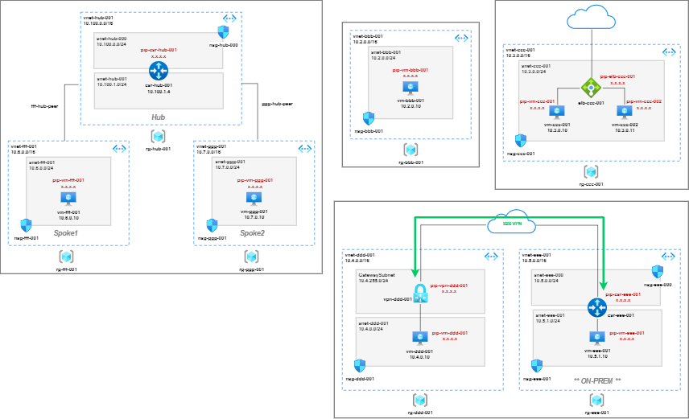

# Azure Networking Lab Building Blocks

These lab building blocks, specifically focussed around Azure networking, enable you quickly deploy and destroy some base constructs to enable you to focus your time on the interesting stuff. All building blocks 'stack' out of the box - that is, if you use the pre-defined variables provided there will never be an overlap in naming or address space when connecting them together to form more complex topologies.

>DISCLAIMER: There's nothing revolutionary here; it's just a bunch of reusable Azure cli scripts, so it you're an experienced beardy DevOps type using Terraform for everthing this probably isn't for you!

In this repo:

* [**VNET / Subnet / NSG / VM**](https://github.com/jtanderson2/azure-network-lab-building-blocks/tree/main/vnet-subnet-nsg-vm)
* [**External Load-Balancer and VMs with Web Server**](https://github.com/jtanderson2/azure-network-lab-building-blocks/tree/main/external-lb-and-vms)
* [**S2S VPN to OnPrem**](https://github.com/jtanderson2/azure-network-lab-building-blocks/tree/main/s2svpn-onprem)
* [**Spoke to Spoke Routing via Hub NVA**](https://github.com/jtanderson2/azure-network-lab-building-blocks/tree/main/spoke-to-spoke-via-hub-nva)
&nbsp;

&nbsp;

