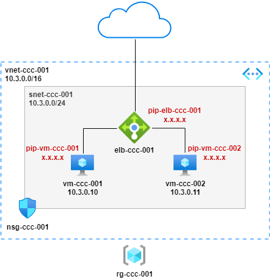

# External Load-Balancer and VMs with Web Server

## Overview

2 VMs running NGINX web server behind an external Load-Balancer, provisioned with Azure CLI:

## Notes

* Variables defined at start of script, change as required
* VMs provisioned with auto-shutdown configured for 22:00 UTC
* NSG rule provisioned to allow SSH access from anywhere for admin access
* NSG rule provisioned to allow HTTP access from anywhere for web testing through LB

## Provision

## Useful Commands

# get public ip of vm
az network public-ip show -g $resourcegroup -n $vm1publicip --query "{address: ipAddress}"
az network public-ip show -g $resourcegroup -n $vm2publicip --query "{address: ipAddress}"

# stop vm
az vm deallocate -g $resourcegroup -n $vm1name --no-wait
az vm deallocate -g $resourcegroup -n $vm2name --no-wait

# start vm
az vm start -g $resourcegroup -n $vm1name --no-wait
az vm start -g $resourcegroup -n $vm2name --no-wait

## Destroy

# delete all resources
az group delete -n $resourcegroup

