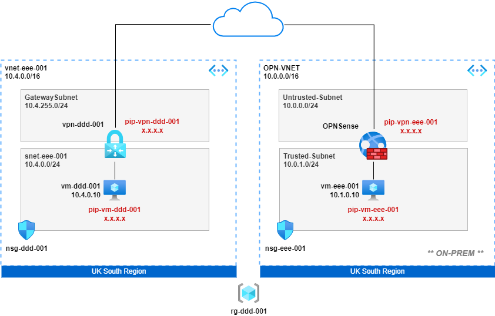

## Overview

VNET Gateway configured for a route-based VPN. A second VNET simulates on-prem running an Cisco CSR router as the VPN termination device.

## Notes

* Variables defined at start of scripts, change as required
* VMs provisioned with auto-shutdown at 22:00 UTC
* Provisions public IPs for VMs and NSG rule to allow SSH admin access (could use serial console instead!)

## Build
> Variables are only persistent within the azcli session. If you need you come back to this in a later session, rerun the variables section

**Global Variables**

<pre lang="...">
# define global variables
location="uksouth"
vmimage="OpenLogic:CentOS:7.5:latest"
vmsize="Standard_B1ls"
vmuser="azureuser"
vmpassword="Msft123Msft123"
</pre>

**Build Azure Side**

<pre lang="...">
# define azure-side variables
dddrg="rg-ddd-001"
dddvnet="vnet-ddd-001"
dddvnetpfx="10.4.0.0/16"
dddsnet="snet-ddd-001"
dddsnetpfx="10.4.0.0/24"
dddgwpfx="10.4.255.0/27"
dddnsg="nsg-ddd-001"
dddnic="nic-vm-ddd-001"
dddprivateip="10.4.0.10"
dddpublicip="pip-vm-ddd-001"
dddvpnpublicip="pip-vpn-ddd-001"
dddvpngw="vpn-ddd-001"
dddvmname="vm-ddd-001"
dddroutetable="route-ddd"

# create azure-side resource group
az group create -n $dddrg --location $location

# create azure-side vnet and subnet
az network vnet create -g $dddrg -n $dddvnet --location $location --address-prefixes $dddvnetpfx --subnet-name $dddsnet --subnet-prefix $dddsnetpfx

# create azure-side nsg
az network nsg create -g $dddrg -n $dddnsg

# create azure-side nsg rule to allow ssh
az network nsg rule create -g $dddrg --nsg-name $dddnsg -n AllowSSH --priority 1000 --source-address-prefixes '*' --source-port-ranges '*' --destination-address-prefix $dddsnetpfx --destination-port-range 22 --access Allow --protocol Tcp --description "Allow SSH"

# associate azure-side nsg with subnet
az network vnet subnet update -g $dddrg -n $dddsnet --vnet-name $dddvnet --network-security-group $dddnsg

# create azure-side public ip for vm
az network public-ip create -n $dddpublicip -g $dddrg --location $location --sku standard

# create azure-side nic for vm, create private ip and and assign public ip
az network nic create -g $dddrg -n $dddnic --location $location --subnet $dddsnet --private-ip-address $dddprivateip --vnet-name $dddvnet --public-ip-address $dddpublicip

# create azure-side linux vm and associate with nic
az vm create -g $dddrg -n $dddvmname --image $vmimage --size $vmsize --admin-username $vmuser --admin-password $vmpassword --nics $dddnic

# auto-shutdown azure-side vm at 22:00 UTC
az vm auto-shutdown -g $dddrg -n $dddvmname --time 2200

# create azure-side gateway subnet
az network vnet subnet create -g $dddrg -n GatewaySubnet --vnet-name $dddvnet --address-prefix $dddgwpfx

# create azure-side public ip for vpn gateway
az network public-ip create -n $dddvpnpublicip -g $dddrg --location $location --sku standard

# create azure-side vpn gateway
az network vnet-gateway create -g $dddrg -n $dddvpngw -l $location --public-ip-address $dddvpnpublicip --vnet $dddvnet --gateway-type Vpn --sku VpnGw1 --vpn-type RouteBased --no-wait
</pre>

> NOTE: The VPN Gateway may take up to 30mins to create, but you can still continue with the next section in the meantime...

**Build 'OnPrem' Side**
<pre lang="...">

# define onprem variables
eeerg="rg-eee-001"
eeevnet="vnet-eee-001"
eeevnetpfx="10.5.0.0/16"
eeesnet0="snet-eee-000"
eeesnet1="snet-eee-001"
eeesnet0pfx="10.5.0.0/24"
eeesnet1pfx="10.5.1.0/24"
eeensg0="nsg-eee-000"
eeensg1="nsg-eee-001"
eeenic="nic-vm-eee-001"
eeecsrnic0="nic-csr-eee-000"
eeecsrnic1="nic-csr-eee-001"
eeeprivateip="10.5.1.10"
eeecsrprivateip0="10.5.0.4"
eeecsrprivateip1="10.5.1.4"
eeepublicip="pip-vm-eee-001"
eeecsrpublicip="pip-csr-eee-001"
eeecsrname="csr-eee-001"
eeevmname="vm-eee-001"
eeeroutetable="route-eee"

# create onprem resource group
az group create -n $eeerg --location $location

# create onprem vnet
az network vnet create -g $eeerg -n $eeevnet --location $location --address-prefixes $eeevnetpfx

# create onprem outside subnet
az network vnet subnet create -g $eeerg -n $eeesnet0 --address-prefix $eeesnet0pfx --vnet-name $eeevnet

# create onprem outside nsg
az network nsg create -g $eeerg -n $eeensg0

# create onprem outside nsg rule to allow ssh
az network nsg rule create -g $eeerg --nsg-name $eeensg0 -n AllowSSH --priority 1000 --source-address-prefixes '*' --source-port-ranges '*' --destination-address-prefix $eeesnet0pfx --destination-port-range 22 --access Allow --protocol Tcp --description "Allow SSH"

# associate onprem outside nsg with subnet
az network vnet subnet update -g $eeerg -n $eeesnet0 --vnet-name $eeevnet --network-security-group $eeensg0

# create onprem inside subnet
az network vnet subnet create -g $eeerg -n $eeesnet1 --address-prefix $eeesnet1pfx --vnet-name $eeevnet

# create onprem inside nsg
az network nsg create -g $eeerg -n $eeensg1

# create onprem inside nsg rule to allow ssh
az network nsg rule create -g $eeerg --nsg-name $eeensg1 -n AllowSSH --priority 1000 --source-address-prefixes '*' --source-port-ranges '*' --destination-address-prefix $eeesnet1pfx --destination-port-range 22 --access Allow --protocol Tcp --description "Allow SSH"

# associate onprem inside nsg with subnet
az network vnet subnet update -g $eeerg -n $eeesnet1 --vnet-name $eeevnet --network-security-group $eeensg1

# create onprem public ip for vm
az network public-ip create -n $eeepublicip -g $eeerg --location $location --sku standard

# create onprem nic for vm, create private ip and and assign public ip
az network nic create -g $eeerg -n $eeenic --location $location --subnet $eeesnet1 --private-ip-address $eeeprivateip --vnet-name $eeevnet --public-ip-address $eeepublicip

# create onprem linux vm and associate with nic
az vm create -g $eeerg -n $eeevmname --image $vmimage --size $vmsize --admin-username $vmuser --admin-password $vmpassword --nics $eeenic

# auto-shutdown onprem vm at 22:00 UTC
az vm auto-shutdown -g $eeerg -n $eeevmname --time 2200

# create onprem public ip for csr
az network public-ip create -n $eeecsrpublicip -g $eeerg --location $location --sku standard

# create onprem outside nic for csr, create private ip and and assign public ip
az network nic create -g $eeerg -n $eeecsrnic0 --location $location --subnet $eeesnet0 --private-ip-address $eeecsrprivateip0 --vnet-name $eeevnet --public-ip-address $eeecsrpublicip

# create onprem inside nic for csr and create private ip
az network nic create -g $eeerg -n $eeecsrnic1 --location $location --subnet $eeesnet1 --private-ip-address $eeecsrprivateip1 --vnet-name $eeevnet

# create an onprem route-table
az network route-table create -g $eeerg -n $eeeroutetable

# create an azure-side route
az network route-table route create -g $eeerg --route-table-name $eeeroutetable -n ddd-route --next-hop-type VirtualAppliance --address-prefix 10.4.0.0/24 --next-hop-ip-address 10.5.1.4

# associate azure-side route-table with subnet
az network vnet subnet update -g $eeerg --vnet-name $eeevnet --name $eeesnet1 --route-table $eeeroutetable

# accept csr license terms
az vm image terms accept --urn cisco:cisco-csr-1000v:17_03_07-byol:latest

# create csr router
az vm create -g $eeerg --location $location --name $eeecsrname --size Standard_D2as_v4 --nics $eeecsrnic0 $eeecsrnic1  --image cisco:cisco-csr-1000v:17_03_07-byol:latest --admin-username $vmuser --admin-password $vmpassword --no-wait
</pre>

## Build VPN
At this point you're ready to start building a VPN. Crack on ;)

## Useful Commands

<pre lang="...">
# get public ip of azure-side vm
az network public-ip show -g $dddrg -n $dddpublicip --query "{address: ipAddress}"

# get public ip of onprem vm
az network public-ip show -g $eeerg -n $eeepublicip --query "{address: ipAddress}"

# get public ip of azure-side vpn-gateway
az network public-ip show -g $dddrg -n $dddvpnpublicip --query "{address: ipAddress}"

# get public ip of onprem csr
az network public-ip show -g $eeerg -n $eeecsrpublicip --query "{address: ipAddress}"

# show status of vpn gateway
az network vnet-gateway list -g $dddrg -o table
 
# stop vms / csr
az vm deallocate -g $dddrg -n $dddvmname --no-wait
az vm deallocate -g $eeerg -n $eeevmname --no-wait
az vm deallocate -g $eeerg -n $eeecsrname --no-wait

# start vms / csr
az vm start -g $dddrg -n $dddvmname --no-wait
az vm start -g $eeerg -n $eeevmname --no-wait
az vm start -g $eeerg -n $eeecsrname --no-wait
</pre>

## Destroy

<pre lang="...">
# delete all azure-side resources
az group delete -n $dddrg

# delete all 'onprem' resources
az group delete -n $eeerg
</pre>

