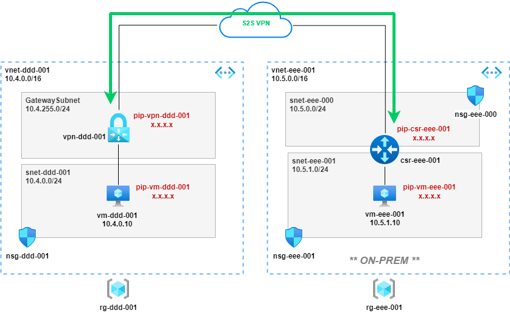

## Overview WIP

VNET Gateway configured for a route-based VPN. A second VNET simulates on-prem running an OPNsense firewall as the VPN termination device.

## Notes

* Variables defined at start of script, change as required
* VMs provisioned with auto-shutdown at 22:00 UTC
* Provisions public IPs for VMs and NSG rule to allow SSH admin access (could use serial console instead!)

## Build

**Global Variables**

<pre lang="...">
# define global variables
location="uksouth"
vmimage="OpenLogic:CentOS:7.5:latest"
vmsize="Standard_B1ls"
vmuser="azureuser"
vmpassword="Msft123Msft123"
</pre>

**Build Azure Side**

<pre lang="...">
# define azure-side variables
dddrg="rg-ddd-001"
dddvnet="vnet-ddd-001"
dddvnetpfx="10.4.0.0/16"
dddsnet="snet-ddd-001"
dddsnetpfx="10.4.0.0/24"
dddgwpfx="10.4.255.0/27"
dddnsg="nsg-ddd-001"
dddnic="nic-vm-ddd-001"
dddprivateip="10.4.0.10"
dddpublicip="pip-vm-ddd-001"
dddvpnpublicip="pip-vpn-ddd-001"
dddvpngw="vpn-ddd-001"
dddvmname="vm-ddd-001"
dddroutetable="route-ddd"

# create azure-side resource group
az group create -n $dddrg --location $location

# create azure-side vnet and subnet
az network vnet create -g $dddrg -n $dddvnet --location $location --address-prefixes $dddvnetpfx --subnet-name $dddsnet --subnet-prefix $dddsnetpfx

# create azure-side nsg
az network nsg create -g $dddrg -n $dddnsg

# create azure-side nsg rule to allow ssh
az network nsg rule create -g $dddrg --nsg-name $dddnsg -n AllowSSH --priority 1000 --source-address-prefixes '*' --source-port-ranges '*' --destination-address-prefix $dddsnetpfx --destination-port-range 22 --access Allow --protocol Tcp --description "Allow SSH"

# associate azure-side nsg with subnet
az network vnet subnet update -g $dddrg -n $dddsnet --vnet-name $dddvnet --network-security-group $dddnsg

# create azure-side public ip for vm
az network public-ip create -n $dddpublicip -g $dddrg --location $location --sku standard

# create azure-side nic for vm, create private ip and and assign public ip
az network nic create -g $dddrg -n $dddnic --location $location --subnet $dddsnet --private-ip-address $dddprivateip --vnet-name $dddvnet --public-ip-address $dddpublicip

# create azure-side linux vm and associate with nic
az vm create -g $dddrg -n $dddvmname --image $vmimage --size $vmsize --admin-username $vmuser --admin-password $vmpassword --nics $dddnic

# auto-shutdown azure-side vm at 22:00 UTC
az vm auto-shutdown -g $dddrg -n $dddvmname --time 2200

# create azure-side gateway subnet
az network vnet subnet create -g $dddrg -n GatewaySubnet --vnet-name $dddvnet --address-prefix $dddgwpfx

# create azure-side public ip for vpn gateway
az network public-ip create -n $dddvpnpublicip -g $dddrg --location $location --sku standard

# create azure-side vpn gateway
az network vnet-gateway create -g $dddrg -n $dddvpngw -l $location --public-ip-address $dddvpnpublicip --vnet $dddvnet --gateway-type Vpn --sku VpnGw1 --vpn-type RouteBased --no-wait
</pre>

**Build 'OnPrem' Side**
<pre lang="...">
blah
</pre>

## Useful Commands

<pre lang="...">
# get public ip of vms & vpn gateway
az network public-ip show -g $dddrg -n $dddpublicip --query "{address: ipAddress}"
az network public-ip show -g $eeerg -n $eeepublicip --query "{address: ipAddress}"
az network public-ip show -g $resourcegroup -n $vpnpublicip --query "{address: ipAddress}"
az network public-ip show -g $resourcegroup -n OPNsense-PublicIP --query "{address: ipAddress}"

# show status of vpn gateway
az network vnet-gateway list --resource-group $dddrg -o table
 
# stop vm
az vm deallocate -g $resourcegroup -n $vmname --no-wait
az vm deallocate -g $resourcegroup -n $opnvmname --no-wait

# start vm
az vm start -g $resourcegroup -n $vmname --no-wait
az vm start -g $resourcegroup -n $opnvmname --no-wait
</pre>

## Destroy

<pre lang="...">
# delete all azure-side resources
az group delete -n $dddrg

# delete all 'pnprem' resources
az group delete -n $eeerg
</pre>

