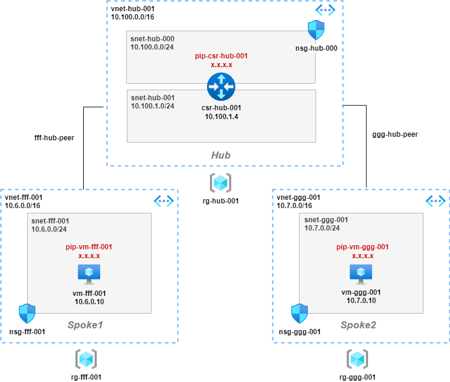

## Overview

Spoke VNET routing via hub NVA.

## Notes

* Variables defined at start of scripts, change as required
* VMs provisioned with auto-shutdown at 22:00 UTC
* Provisions public IPs for VMs and NSG rule to allow SSH admin access (could use serial console instead!)

## Build
> Variables are only persistent within the azcli session. If you need you come back to this in a later session, rerun the variables sections

**Global Variables**

<pre lang="...">
# define global variables
location="uksouth"
vmimage="OpenLogic:CentOS:7.5:latest"
vmsize="Standard_B1ls"
vmuser="azureuser"
vmpassword="Msft123Msft123"
</pre>

**Build Spoke 1**

<pre lang="...">
# define spoke1 variables
fffrg="rg-fff-001"
fffvnet="vnet-fff-001"
fffvnetpfx="10.6.0.0/16"
fffsnet="snet-fff-001"
fffsnetpfx="10.6.0.0/24"
fffnsg="nsg-fff-001"
fffnic="nic-vm-fff-001"
fffprivateip="10.6.0.10"
fffpublicip="pip-vm-fff-001"
fffvmname="vm-fff-001"
fffroutetable="route-fff"

# create spoke1 resource group
az group create -n $fffrg --location $location

# create spoke1 vnet and subnet
az network vnet create -g $fffrg -n $fffvnet --location $location --address-prefixes $fffvnetpfx --subnet-name $fffsnet --subnet-prefix $fffsnetpfx

# create spoke1 nsg
az network nsg create -g $fffrg -n $fffnsg

# create spoke1 nsg rule to allow ssh
az network nsg rule create -g $fffrg --nsg-name $fffnsg -n AllowSSH --priority 1000 --source-address-prefixes '*' --source-port-ranges '*' --destination-address-prefix $fffsnetpfx --destination-port-range 22 --access Allow --protocol Tcp --description "Allow SSH"

# associate spoke1 nsg with subnet
az network vnet subnet update -g $fffrg -n $fffsnet --vnet-name $fffvnet --network-security-group $fffnsg

# create spoke1 public ip for vm
az network public-ip create -n $fffpublicip -g $fffrg --location $location --sku standard

# create spoke1 nic for vm, create private ip and and assign public ip
az network nic create -g $fffrg -n $fffnic --location $location --subnet $fffsnet --private-ip-address $fffprivateip --vnet-name $fffvnet --public-ip-address $fffpublicip

# create spoke1 linux vm and associate with nic
az vm create -g $fffrg -n $fffvmname --image $vmimage --size $vmsize --admin-username $vmuser --admin-password $vmpassword --nics $fffnic

# auto-shutdown spoke1 vm at 22:00 UTC
az vm auto-shutdown -g $fffrg -n $fffvmname --time 2200

# create an spoke1 route-table
az network route-table create -g $fffrg -n $fffroutetable

# create an spoke1 route
az network route-table route create -g $fffrg --route-table-name $fffroutetable -n ggg-route --next-hop-type VirtualAppliance --address-prefix 10.7.0.0/24 --next-hop-ip-address 10.100.1.4

# associate spoke1 route-table with subnet
az network vnet subnet update -g $fffrg --vnet-name $fffvnet --name $fffsnet --route-table $fffroutetable
</pre>

**Build Spoke 2**

<pre lang="...">
# define spoke2 variables
gggrg="rg-ggg-001"
gggvnet="vnet-ggg-001"
gggvnetpfx="10.7.0.0/16"
gggsnet="snet-ggg-001"
gggsnetpfx="10.7.0.0/24"
gggnsg="nsg-ggg-001"
gggnic="nic-vm-ggg-001"
gggprivateip="10.7.0.10"
gggpublicip="pip-vm-ggg-001"
gggvmname="vm-ggg-001"
gggroutetable="route-ggg"

# create spoke2 resource group
az group create -n $gggrg --location $location

# create spoke2 vnet and subnet
az network vnet create -g $gggrg -n $gggvnet --location $location --address-prefixes $gggvnetpfx --subnet-name $gggsnet --subnet-prefix $gggsnetpfx

# create spoke2 nsg
az network nsg create -g $gggrg -n $gggnsg

# create spoke2 nsg rule to allow ssh
az network nsg rule create -g $gggrg --nsg-name $gggnsg -n AllowSSH --priority 1000 --source-address-prefixes '*' --source-port-ranges '*' --destination-address-prefix $gggsnetpfx --destination-port-range 22 --access Allow --protocol Tcp --description "Allow SSH"

# associate spoke2 nsg with subnet
az network vnet subnet update -g $gggrg -n $gggsnet --vnet-name $gggvnet --network-security-group $gggnsg

# create spoke2 public ip for vm
az network public-ip create -n $gggpublicip -g $gggrg --location $location --sku standard

# create spoke2 nic for vm, create private ip and and assign public ip
az network nic create -g $gggrg -n $gggnic --location $location --subnet $gggsnet --private-ip-address $gggprivateip --vnet-name $gggvnet --public-ip-address $gggpublicip

# create spoke2 linux vm and associate with nic
az vm create -g $gggrg -n $gggvmname --image $vmimage --size $vmsize --admin-username $vmuser --admin-password $vmpassword --nics $gggnic

# auto-shutdown spoke2 vm at 22:00 UTC
az vm auto-shutdown -g $gggrg -n $gggvmname --time 2200

# create an spoke2 route-table
az network route-table create -g $gggrg -n $gggroutetable

# create an spoke2 route
az network route-table route create -g $gggrg --route-table-name $gggroutetable -n fff-route --next-hop-type VirtualAppliance --address-prefix 10.6.0.0/24 --next-hop-ip-address 10.100.1.4

# associate spoke2 route-table with subnet
az network vnet subnet update -g $gggrg --vnet-name $gggvnet --name $gggsnet --route-table $gggroutetable
</pre>

**Build Hub and NVA**

<pre lang="...">
# define hub variables
hubrg="rg-hub-001"
hubvnet="vnet-hub-001"
hubvnetpfx="10.100.0.0/16"
hubsnet0="snet-hub-000"
hubsnet1="snet-hub-001"
hubsnet0pfx="10.100.0.0/24"
hubsnet1pfx="10.100.1.0/24"
hubnsg0="nsg-hub-000"
hubcsrnic0="nic-csr-hub-000"
hubcsrnic1="nic-csr-hub-001"
hubcsrprivateip0="10.100.0.4"
hubcsrprivateip1="10.100.1.4"
hubcsrpublicip="pip-csr-hub-001"
hubcsrname="csr-hub-001"

# create hub resource group
az group create -n $hubrg --location $location

# create hub vnet
az network vnet create -g $hubrg -n $hubvnet --location $location --address-prefixes $hubvnetpfx

# create hub outside subnet
az network vnet subnet create -g $hubrg -n $hubsnet0 --address-prefix $hubsnet0pfx --vnet-name $hubvnet

# create hub outside nsg
az network nsg create -g $hubrg -n $hubnsg0

# create hub outside nsg rule to allow ssh
az network nsg rule create -g $hubrg --nsg-name $hubnsg0 -n AllowSSH --priority 1000 --source-address-prefixes '*' --source-port-ranges '*' --destination-address-prefix $hubsnet0pfx --destination-port-range 22 --access Allow --protocol Tcp --description "Allow SSH"

# associate hub outside nsg with subnet
az network vnet subnet update -g $hubrg -n $hubsnet0 --vnet-name $hubvnet --network-security-group $hubnsg0

# create hub inside subnet
az network vnet subnet create -g $hubrg -n $hubsnet1 --address-prefix $hubsnet1pfx --vnet-name $hubvnet

# create hub public ip for csr
az network public-ip create -n $hubcsrpublicip -g $hubrg --location $location --sku standard

# create hub outside nic for csr, create private ip and and assign public ip
az network nic create -g $hubrg -n $hubcsrnic0 --location $location --subnet $hubsnet0 --private-ip-address $hubcsrprivateip0 --vnet-name $hubvnet --public-ip-address $hubcsrpublicip --ip-forwarding true

# create hub inside nic for csr and create private ip
az network nic create -g $hubrg -n $hubcsrnic1 --location $location --subnet $hubsnet1 --private-ip-address $hubcsrprivateip1 --vnet-name $hubvnet --ip-forwarding true

# accept csr license terms
az vm image terms accept --urn cisco:cisco-csr-1000v:17_03_07-byol:latest

# create csr router
az vm create -g $hubrg --location $location --name $hubcsrname --size Standard_D2as_v4 --nics $hubcsrnic0 $hubcsrnic1  --image cisco:cisco-csr-1000v:17_03_07-byol:latest --admin-username $vmuser --admin-password $vmpassword --no-wait
</pre>

**Create VNET Peerings**

<pre lang="...">
# create spoke1 to hub vnet peer
az network vnet peering create -g $fffrg -n fff-hub-peer --vnet-name $fffvnet --remote-vnet $hubvnet --allow-vnet-access true --allow-forwarded-traffic true

# create spoke2 to hub vnet peer
az network vnet peering create -g $gggrg -n ggg-hub-peer --vnet-name $gggvnet --remote-vnet $hubvnet --allow-vnet-access true --allow-forwarded-traffic true
</pre>

** Add Routes to CSR **

## Useful Commands

<pre lang="...">
# show vnet peerings
az network vnet peering list --resource-group $fffrg --vnet-name $fffvnet
</pre>

