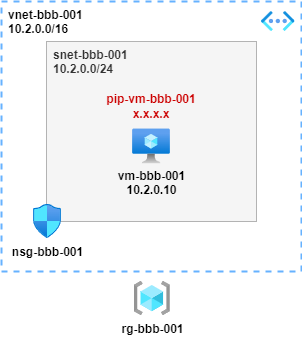

# VNET / Subnet / NSG / VM

## Overview

A basic building block as per diagram; VNET, Subnet, NSG and a single VM 

## Notes

* Variables defined at start of script, change as required
* VM provisioned with auto-shutdown at 22:00 UTC
* NSG rule provisioned to allow SSH access from anywhere for admin access via the public IP

## Provision

<pre lang="...">
# define variables
resourcegroup="rg-bbb-001"
location="uksouth"
vnet="vnet-bbb-001"
vnetpfx="10.2.0.0/16"
snet="snet-bbb-001"
snetpfx="10.2.0.0/24"
nsg="nsg-bbb-001"
nic="nic-vm-bbb-001"
privateip="10.2.0.10"
publicip="pip-vm-bbb-001"
vmname="vm-bbb-001"
vmimage="OpenLogic:CentOS:7.5:latest"
vmsize="Standard_B1ls"
vmuser="azureuser"
vmpassword="Msft123Msft123"

# create resource group
az group create -n $resourcegroup --location $location

# create vnet and subnet
az network vnet create -g $resourcegroup -n $vnet --location $location --address-prefixes $vnetpfx --subnet-name $snet --subnet-prefix $snetpfx

# create nsg
az network nsg create -g $resourcegroup -n $nsg

# create nsg rule to allow ssh
az network nsg rule create -g $resourcegroup --nsg-name $nsg -n AllowSSH --priority 1000 --source-address-prefixes '*' --source-port-ranges '*' --destination-address-prefixes $snetpfx --destination-port-range 22 --access Allow --protocol Tcp --description "Allow SSH"

# associate nsg with subnet
az network vnet subnet update -g $resourcegroup -n $snet --vnet-name $vnet --network-security-group $nsg

# create public ip for vm
az network public-ip create -n $publicip -g $resourcegroup --location $location --sku standard

# create nic for vm, create private ip and and assign public ip
az network nic create -g $resourcegroup -n $nic --location $location --subnet $snet --private-ip-address $privateip --vnet-name $vnet --public-ip-address $publicip

#create linux vm and associate with nic
az vm create -g $resourcegroup -n $vmname --image $vmimage --size $vmsize --admin-username $vmuser --admin-password $vmpassword --nics $nic

#auto-shutdown vm at 10:00 UTC
az vm auto-shutdown -g $resourcegroup -n $vmname --time 2200
</pre>

## Useful Commands
<pre lang="...">
# get public ip of vm
az network public-ip show -g $resourcegroup -n $publicip --query "{address: ipAddress}"

# stop vm
az vm deallocate -g $resourcegroup -n $vmname --no-wait

# start vm
az vm start -g $resourcegroup -n $vmname --no-wait

# show commonly used vm images available in your region; the 'Urn' field in the output is what to use as the --image variable when creating a vm
az vm image list --location $location --output table

# show vm sizes available in your region; the 'Name' field in the output is what to use as the --size variable when creating a vm
az vm list-sizes --location $location --output table
</pre>

## Destroy
<pre lang="...">
# delete all resources
az group delete -n $resourcegroup
</pre>

